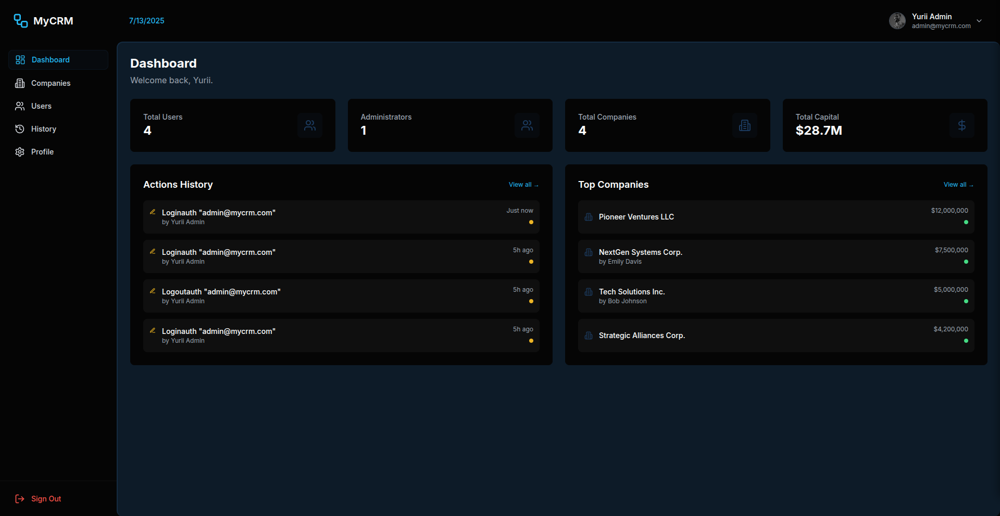

# Mashchuk CRM



A modern CRM system for managing companies, users, and business operations.

---

## 🚀 Tech Stack

### Frontend
- **React** (TypeScript)
- **Vite**
- **React Query (@tanstack/react-query)**
- **Tailwind CSS v3**
- **Recharts**
- **React Leaflet**

### Backend
- **Node.js** (ESM)
- **Express.js**
- **Prisma ORM**
- **Swagger (OpenAPI YAML docs)**

### Database
- **PostgreSQL**

---

## 📦 Monorepo Structure

```
├── apps/
│   ├── frontend/   # React + Vite app
│   └── backend/    # Express API, Prisma, Swagger
├── package.json    # Monorepo root
├── docker-compose.yml
```

---

## 🖼️ Screenshots

<table>
  <tr>
    <td align="center"><b>Dashboard</b></td>
    <td align="center"><b>Add Company</b></td>
    <td align="center"><b>Mobile Dashboard</b></td>
  </tr>
  <tr>
    <td></td>
    <td></td>
    <td></td>
  </tr>
</table>

- Dashboard, company management, mobile view

---

## 🛠️ Getting Started

### Local Development

1. **Install dependencies:**
   ```sh
   npm install
   ```
2. **Setup environment variables:**
   - Copy `.env.example` to `.env` in `apps/backend` and configure DB connection.
3. **Run database migrations and seed:**
   ```sh
   npm run migrate && npm run seed
   ```
4. **Start development servers:**
   ```sh
   npm run dev
   ```

### Docker

1. **Run with Docker Compose:**
   ```sh
   docker-compose up -d
   ```

2. **Access the application:**
   - Frontend: http://localhost:3000
   - Backend API: http://localhost:5000

---

## 📄 License

MIT
